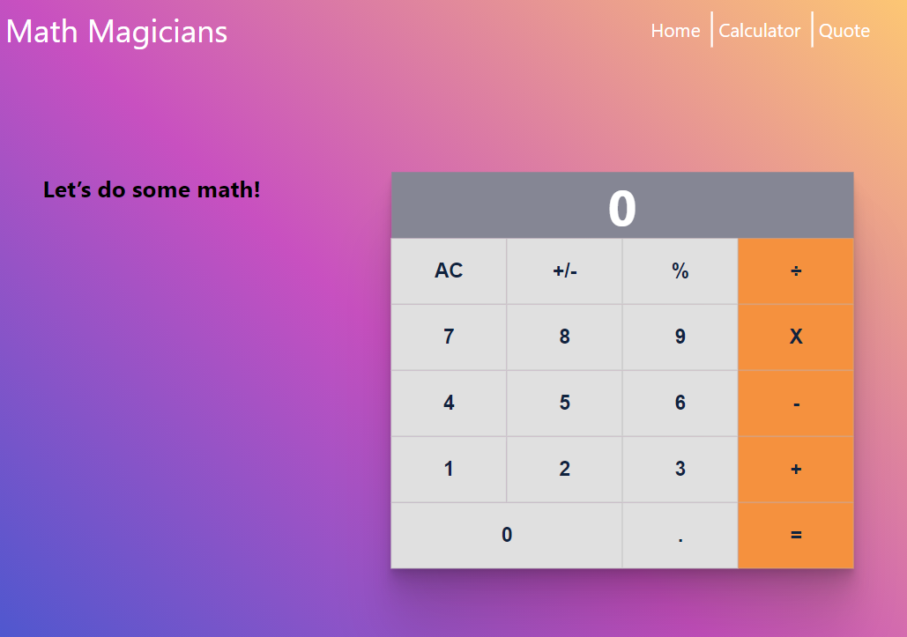

  

# React calculator.

In this project, a calculator is built using the React.js library.

## Landing page

## This web app is live, you can check it here: 

## [Live demo](https://reactcalculatormicroverse.herokuapp.com/)

## Built With

- React
- create-react-app
- Bootstrap

## Prerequisities

To get this project up and running locally, you must have [node](https://nodejs.org/en/)  and [yarn](https://yarnpkg.com/) installed locally.

## Getting Started

**To get this project set up on your local machine, follow these simple steps:**

**Step 1** 
Navigate through the local folder where you want to clone the repository and run 
`git@github.com:Abhigyan001/calculatorReact.git`. It will clone the repo to your local folder. 
or with https 
`https://github.com/Abhigyan001/calculatorReact.git`. 
**Step 2** 
Run `cd calculatorReact` 
**Step 3** 
Run `npm install` to install the npm packages from the `package.json` file. 
**Step 4** 
Run `npm start` to start the webpack server, you can now navigate to `http://localhost:3000` to view the app. The server refreshes the app every time you make a change to a file used by it. 
**Step 5** 
Most important, enjoy the app! 

## Author

👤 **Abhigyan Mahanta**
​

- Github: [Abhigyan](https://github.com/Abhigyan001)
   
- Linkedin: [Abhigyan Mahanta](https://www.linkedin.com/in/abhigyan001/)

- Twitter: [@abhigyan_001](https://twitter.com/abhigyan_001)

## 🤝 Contributing

Our favourite contributions are those that help us improve the project, whether with a contribution, an issue, or a feature request!

## Show your support

If you've read this far....give us a ⭐️!

## 📝 License

This project is licensed by Microverse and the Odin Project
